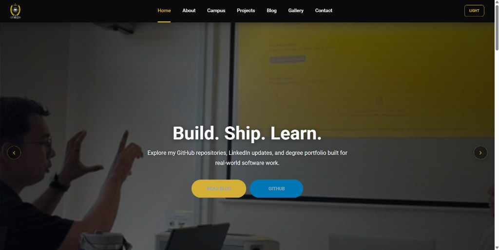
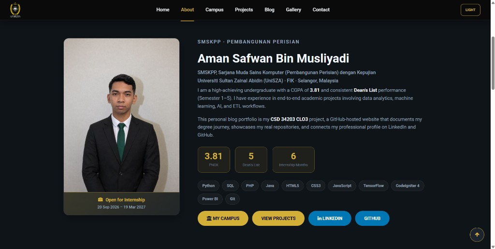
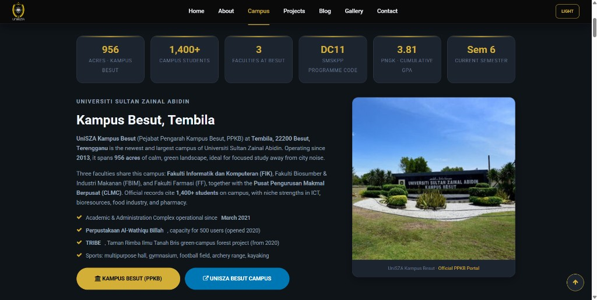
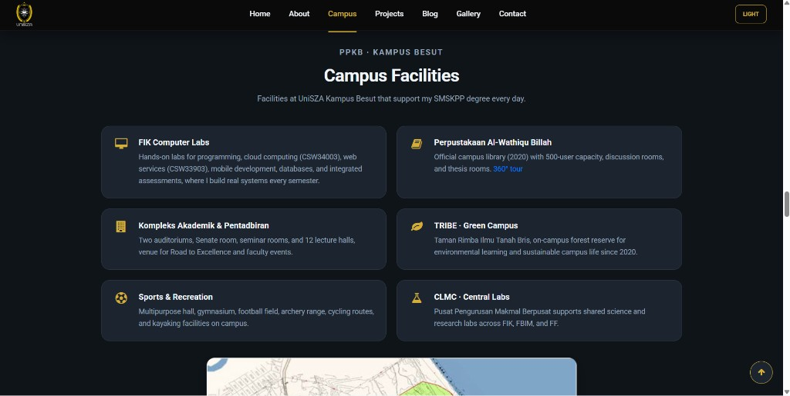
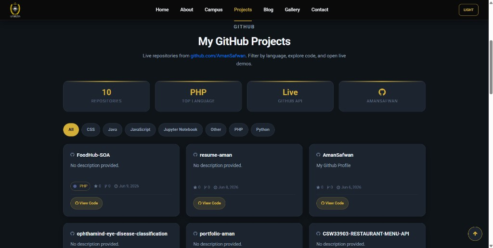
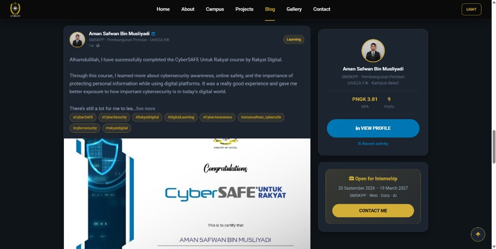
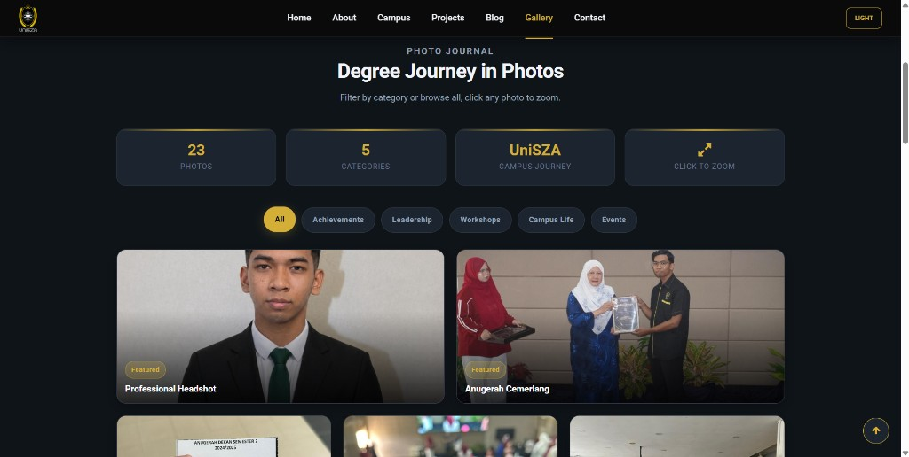
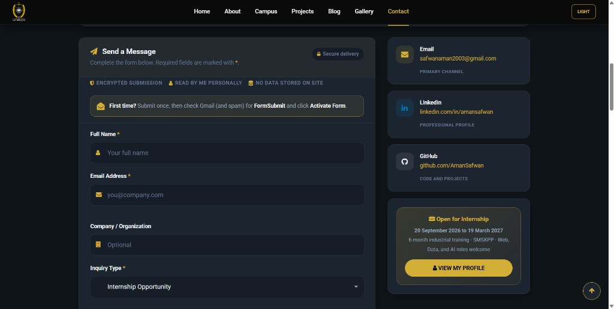

# Personal Blog Portfolio, Aman Safwan

**Course:** CSD 34203, Special Topics in Software Development  
**Faculty:** FIK (Faculty of Informatics and Computing), UniSZA  
**Assessment:** CLO3, GitHub Portfolio (Personal Blog Page), 20%  
**Main Project:** Personal Blog / Portfolio Website  
**Author:** Aman Safwan, Software Development Student

---

## Project Description

This repository contains my **Personal Blog Portfolio**, a multi-page website built with HTML, CSS, and JavaScript. It demonstrates my software development learning journey, showcases my real GitHub repositories, and documents how I plan, build, and deliver projects independently.

The site is designed for professional presentation and is deployed on **GitHub Pages** as a living portfolio for my degree.

---

## Live Demo

**GitHub Pages:** [https://amansafwan.github.io/portfolio-aman/](https://amansafwan.github.io/portfolio-aman/)

**GitHub Repository:** [https://github.com/AmanSafwan/portfolio-aman](https://github.com/AmanSafwan/portfolio-aman)

**GitHub Profile:** [https://github.com/AmanSafwan](https://github.com/AmanSafwan)

---

## Features

| Feature | Description |
|---------|-------------|
| **Home Page** | Hero slider, portfolio overview, live GitHub repositories |
| **About Page** | Profile, degree focus, skills progress indicators |
| **Campus Page** | UniSZA Kampus Besut, FIK, study environment & journey |
| **Projects Page** | Live-loaded repositories from GitHub API |
| **Blog Page** | LinkedIn feed with real post embeds |
| **Gallery Page** | 36+ photos with category filters and lightbox |
| **Contact Page** | Working contact form with validation (sends to email) |
| **Responsive Design** | Mobile-friendly layout using Bootstrap + custom CSS |
| **CSS Styling** | Layout, colors, typography, cards, and sections |
| **JavaScript** | Dark/light theme, active navigation, carousel, scroll-to-top, GitHub API |
| **GitHub Integration** | Real repositories linked and displayed dynamically |
| **GitHub Pages Ready** | Deployed at `amansafwan.github.io/portfolio-aman` |

---

## Technologies Used

- **HTML5**, Page structure and semantic content
- **CSS3**, Layout, typography, colors, responsive design, theme system
- **JavaScript**, Interactivity, form handling, GitHub API, theme persistence
- **jQuery**, DOM manipulation and plugins
- **Bootstrap**, Responsive grid and components
- **Owl Carousel**, Hero slider animations
- **SlickNav**, Mobile navigation menu
- **FormSubmit**, Contact form email delivery
- **Git & GitHub**, Version control, repository hosting, GitHub Pages

---

## File Format: HTML (not PHP)

This project uses **static HTML** pages on purpose:

| Format | Used? | Reason |
|--------|-------|--------|
| **HTML** | Yes | GitHub Pages serves static files. No server required. |
| **PHP** | No | Not needed. Contact form uses [FormSubmit](https://formsubmit.co) (AJAX). GitHub API and LinkedIn feed run in the browser. |
| **JSON** | Yes | Data files for LinkedIn feed (`data/`) |

If you open the site in **XAMPP** (`htdocs/portfolio-aman/`), HTML works the same. PHP would only be useful for server-side forms or database work, which this portfolio does not use.

---

## Folder Structure

```text
portfolio-aman/
├── index.html              # Home
├── about.html              # About
├── campus.html             # UniSZA campus & FIK
├── projects.html           # GitHub projects
├── blog.html               # Blog & LinkedIn feed
├── gallery.html            # Photo journal
├── contact.html            # Contact form
├── assets/
│   ├── css/                # Stylesheets (Bootstrap, theme, components)
│   ├── js/                 # JavaScript (main, LinkedIn feed)
│   ├── fonts/              # Font Awesome webfonts
│   └── img/
│       ├── banners/        # Page header images (1920×520)
│       ├── brand/          # UniSZA logo
│       ├── campus/         # Official campus photos
│       ├── gallery/        # Personal photo journal
│       └── profile/        # Profile images
├── data/                   # LinkedIn feed JSON
├── docs/
│   └── source-archives/    # Original template/vendor zip files
├── scripts/                # LinkedIn sync script (Node.js)
├── .github/workflows/      # GitHub Actions
├── .nojekyll               # GitHub Pages (skip Jekyll)
├── .gitignore
└── README.md
```

---

## Assignment Requirements Checklist (CLO3)

### Development Requirements

- [x] Home page created (`index.html`)
- [x] About page created (`about.html`)
- [x] Blog page with 2–3 sample posts (`blog.html`, 3 posts)
- [x] Contact page included (`contact.html`)
- [x] Website responsive for mobile (Bootstrap + media queries)
- [x] CSS styles included, layout, colors, typography
- [x] Basic JavaScript interaction, dark mode, carousel, form validation, GitHub API

### GitHub Requirements

- [x] GitHub repository created (`portfolio-aman`)
- [x] Organized and clean folder structure
- [x] Meaningful commits with clear messages (see below)
- [x] Updated README.md with full documentation
- [x] Deployed using GitHub Pages

### README Documentation

- [x] Project title
- [x] Description
- [x] Features list
- [x] Technologies used
- [x] Screenshots included (home, about, campus, projects, blog, gallery, contact)
- [x] How to run the project
- [x] Demo link (GitHub Pages)

---

## How to Run Locally

1. Clone the repository:
   ```bash
   git clone https://github.com/AmanSafwan/portfolio-aman.git
   ```
2. Open the project folder in VS Code.
3. Open `index.html` in your browser (Chrome, Edge, or Firefox).
4. Navigate between pages using the menu, or open via XAMPP: `http://localhost/portfolio-aman/`

---

## GitHub Pages Deployment

1. Push all files to GitHub repository `AmanSafwan/portfolio-aman`.
2. Go to **Settings → Pages**.
3. Under **Build and deployment**:
   - Source: **Deploy from a branch**
   - Branch: **main** (or your default branch)
   - Folder: **/ (root)**
4. Save and wait 1–3 minutes for deployment.
5. Visit: [https://amansafwan.github.io/portfolio-aman/](https://amansafwan.github.io/portfolio-aman/)

---

## Recommended Commit Messages (Minimum 3)

Use meaningful commits to show development progress:

```text
1. feat: add project structure and home page layout
2. feat: style about, blog, and contact pages with responsive CSS
3. feat: add dark mode, contact form, and GitHub repository integration
4. docs: update README with features, demo link, and deployment guide
```

---

## Screenshots

Captured from the live site at [https://amansafwan.github.io/portfolio-aman/](https://amansafwan.github.io/portfolio-aman/).

### Home



### About



### Campus





### Projects



### Blog



### Gallery



### Contact



---

## Entrepreneurial Skills Demonstrated (MQF4b)

| Criteria | How This Project Demonstrates It |
|----------|----------------------------------|
| **Initiative** | Added GitHub API integration, theme toggle, and contact form beyond basic HTML |
| **Creativity & Innovation** | Professional UI design, dark/light themes, interactive cards and animations |
| **Problem-Solving** | Fixed theme contrast, contact delivery, and responsive layout issues |
| **Opportunity Recognition** | Portfolio built for internship visibility and professional branding |
| **Risk-Taking & Experimentation** | Used GitHub API and FormSubmit for real-world functionality |
| **Planning & Organization** | Clear folder structure, separated HTML/CSS/JS, meaningful commits |
| **Communication (README)** | Complete documentation with features, setup, and deployment guide |
| **Adaptability** | Improved design and features based on testing and feedback |
| **Value Creation (User Focus)** | Readable content, working contact form, accessible navigation |
| **Commitment & Effort** | Consistent development with documented commit history |

---

## Contact

**Aman Safwan**  
Software Development Student, UniSZA  
Email: safwanaman2003@gmail.com  
GitHub: [https://github.com/AmanSafwan](https://github.com/AmanSafwan)  
LinkedIn: [https://www.linkedin.com/in/amansafwan](https://www.linkedin.com/in/amansafwan)

---

## License

This project was created for academic purposes (CSD 34203, CLO3 Individual Project).
